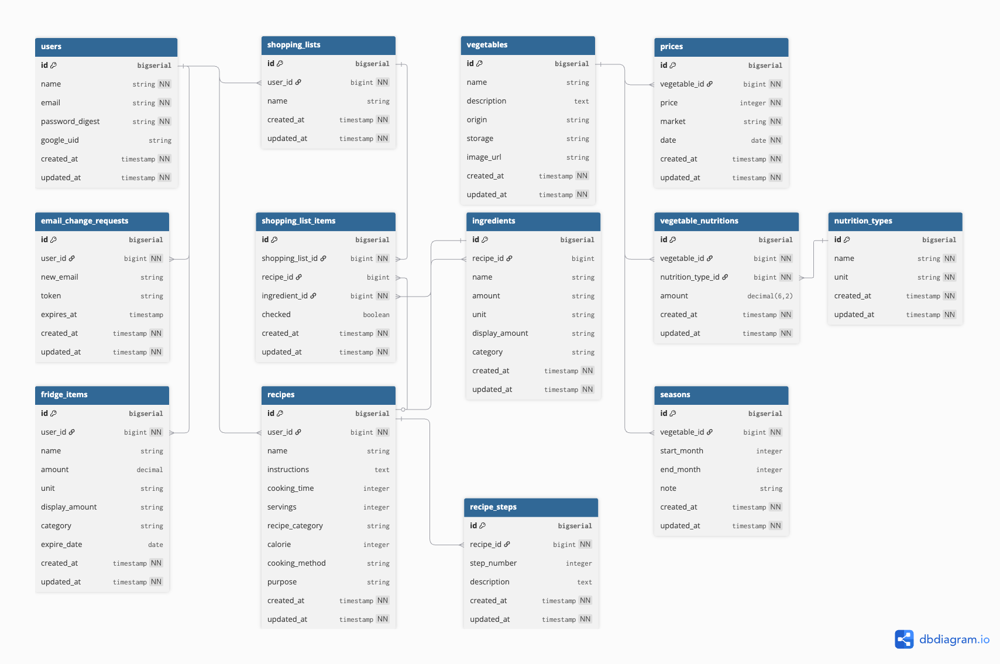
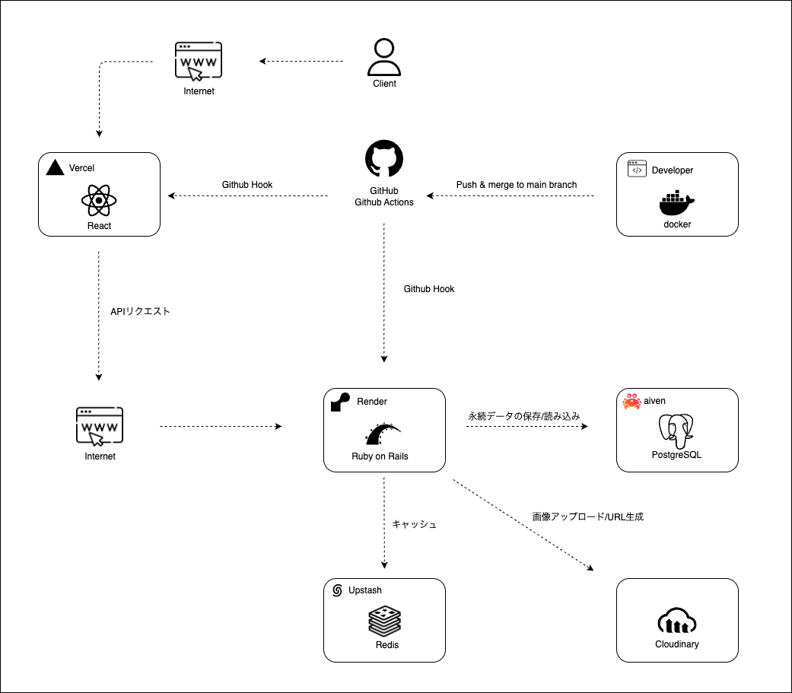

# **VegeGuide**
> 忙しい社会人のための野菜選び・レシピ提案・食材管理サービス  
### 🔗 [実際のサービスはこちら](https://vegeguide.com/)

## 📑 目次

1. [VegeGuide とは](#vegeguide)
2. [各リポジトリ一覧](#各リポジトリ一覧)
3. [サービス概要](#サービス概要)
4. [開発背景](#開発背景)
5. [サービス利用イメージ](#サービス利用イメージ)
6. [主要な機能](#主要な機能)
7. [技術スタック](#技術スタック)
8. [ER図](#er図)
9. [インフラ図](#インフラ図)
10. [今後の展開](#今後の展開)

## 各リポジトリ一覧

| リポジトリ名 | 内容説明               | リンク                                                |
|--------------|------------------------|-----------------------------------------------------|
| Backend      | APIサーバー（Rails） | [github.com/pekoemood/vegeguidebackend](https://github.com/pekoemood/vegeguidebackend)     |
| Frontend     | フロントエンド（React） | [github.com/pekoemood/vegeguidefrontend](https://github.com/pekoemood/vegeguidefrontend)   |

## 📌 サービス概要

**VegeGuide**は、忙しい社会人が「何を買えばいいのか」「どう使えばいいのか」と迷う日常をなくすためのWebサービスです。  
野菜を中心とした食生活を、**選ぶ・作る・管理する**までトータルでサポートします。

ユーザーは、**旬で安く美味しい野菜を選び、AIが提案するレシピで効率的に調理し、食材を無駄にしない**という結果を得られます。  
料理初心者でも、**今日何を作るか迷わず、ムダなく健康的に食生活を楽しめる**ようになります。

## 🛠️ 開発背景

私自身が30歳を迎え、健康的な食生活を始めようとしたとき、  
「どの野菜を選べばいいのか」「どう調理すればいいのか」がわからず、迷う日々が続きました。  
気づけばいつも同じような野菜ばかり選び、同じ料理を繰り返してしまっていたのです。  
忙しい社会人生活の中で、食材選びや調理のハードルの高さを実感したことが、このサービスを作るきっかけです。

- スーパーで野菜を見ても「どの野菜が旬なのか」「どう調理すればいいのか」がわからない  
- 野菜を買っても使い切れず、腐らせてしまう  
- 健康的な食事を心がけたいが、レシピを考えるのが面倒  
- 食材の栄養価や保存方法など、基本的な知識がなく迷いを感じる  

こうした課題を解決し、「迷わず・ムダなく・健康的に」食生活を楽しめるよう、  
野菜選びから調理までをサポートするWebサービスを開発しました。

## 🧭 サービス利用イメージ

1. **仕事帰りにアプリを開く**  
　└ 今日の旬・価格の安い野菜を確認

2. **AIによるレシピ提案を受ける**  
　└ AIが旬の野菜をもとにレシピを自動生成  

3. **レシピをもとに買い物リストを自動作成**  
　└ 必要な食材を必要なだけ無駄なく購入  

4. **買い物後、レシピ情報をもとに調理開始**  
　└ 手順付きレシピでスムーズに調理  

5. **余った材料を冷蔵庫機能に登録**  
　└ 食材の在庫と賞味期限をまとめて管理 

6. **余った食材から新しいレシピを再提案**  
　└ 無駄なく、食材を最後まで使い切る

## 🧩 主要な機能

| 🥦 **野菜一覧ページ** |
| :--- |
|  |
|※ クリックで操作画面を表示します。 旬で安い野菜を一覧でチェックできます。今日のおすすめがひと目でわかります。 |

| 🔍 **野菜詳細ページ** |
| :--- |
|  |
|選んだ野菜の価格推移・栄養素・保存方法をまとめて確認できます。 |

| 🤖 **AIレシピ提案ページ** |
| :--- |
|  |
|選んだ野菜からAIが自動でレシピを生成。 気に入ったレシピは保存して、レシピ一覧からいつでも確認できます。|

| 📖 **レシピ一覧ページ** |
| :--- |
|  |
|作成した買い物リストのカテゴリごとの整理・チェック・追加・削除・冷蔵庫登録が ワンクリックで行えます。リスト内の食材をまとめて冷蔵庫に登録することも可能です。 |

| 🛒 **買い物リストページ** |
| :--- |
|  |
|作成した買い物リストをカテゴリごとに確認や、チェック・追加・削除・冷蔵庫登録ができます。 また、買い物リストの食材をまとめて冷蔵庫に登録することも可能です。 |

| 🧊 **冷蔵庫管理ページ** |
| :--- |
|  |
|余った食材を登録し、在庫や期限を一元管理。 登録済みの食材をもとにAIが新しいレシピを再提案します。 |

## 🧪 技術スタック

### 🔙 バックエンド

| 技術                         | バージョン | 用途                             |
|------------------------------|-------------|----------------------------------|
| Ruby on Rails                | 7.2.2.2     | APIサーバー                      |
| PostgreSQL                   | -           | メインデータベース               |
| GoodJob                      | 4.12.0      | 非同期処理エンジン（DBベース）   |
| HTTParty                     | 0.23.1      | HTTPクライアント                 |
| jsonapi-serializer           | 2.2.0       | JSON:APIシリアライザ             |
| ActiveStorage Cloudinary Service | 0.2.3   | 画像アップロード/配信            |
| Cloudinary (Ruby SDK)        | 2.4.0       | 画像管理・最適化                 |

### 🖥️ フロントエンド

| 技術              | バージョン | 用途                             |
|-------------------|------------|----------------------------------|
| React             | 19.0.0     | UIフレームワーク（最新機能活用）|
| Vite              | 6.2.0      | 開発サーバー/ビルド              |
| TypeScript        | 5.8.3      | 型定義付き言語/型チェック        |
| Tailwind CSS      | 4.1.3      | ユーティリティファーストCSS      |
| DaisyUI           | 5.0.12     | UIコンポーネントライブラリ       |
| React Router      | 7.5.0      | ルーティング                     |
| React Hook Form   | 7.55.0     | フォーム管理                     |
| Zod               | 3.24.3     | スキーマバリデーション           |
| Recharts          | 2.15.3     | データ可視化                     |
| Axios             | 1.8.4      | HTTPクライアント                 |
| date-fns          | 4.1.0      | 日付ユーティリティ               |
| Lucide React      | 0.507.0    | アイコンライブラリ               |
| React Hot Toast   | 2.5.2      | トースト通知                     |

### 🔐 認証・セキュリティ

| 技術 / ライブラリ              | バージョン | 用途                           |
|-------------------------------|-------------|--------------------------------|
| JWT                           | 3.1.2       | 認証トークン                   |
| bcrypt                        | 3.1.20      | パスワードハッシュ化           |
| googleauth (Ruby)             | 1.15.0      | Googleログイン（サーバー側）   |
| @react-oauth/google           | 0.12.2      | Googleログイン（フロント側）   |
| rack-cors                     | 3.0.0       | CORS制御                       |
| Rails CSRF Token              | -           | CSRF対策（レスポンスヘッダ発行）|

### 🌐 外部API・サービス

| サービス名              | 用途                          |
|--------------------------|-------------------------------|
| Google Gemini API        | AI文章生成・レシピ/画像生成    |
| Cloudinary               | 画像ホスティング/最適化        |
| 青果物市況情報Web API     | 野菜価格データ取得             |

### ☁️ インフラ・デプロイ

| 技術 / サービス | 用途                          |
|-----------------|-------------------------------|
| Docker          | コンテナ化（開発環境）         |
| GitHub Actions | CI/CDパイプライン。テスト・Lint・デプロイを自動実行。|
| Render          | バックエンドホスティング       |
| Vercel          | フロントエンドホスティング     |
| Aiven (PostgreSQL) | マネージドDBサービス |
| Upstash (Redis) | マネージドキャッシュ |

### 🧰 開発ツール・テスト

| ツール / ライブラリ                            | バージョン | 用途                                      |
|------------------------------------------------|-------------|-------------------------------------------|
| RuboCop Rails Omakase       | 1.1.0       | Rails推奨スタイルガイドに基づいた静的解析・コード整形ツール。|
| RSpec                       | 8.0.2       | Rails用テストフレームワーク。|
| Factory Bot                 | 6.5.1       | テストデータを簡潔に生成するヘルパーライブラリ。|
| Shoulda Matchers            | 6.5.0       | モデルのバリデーションや関連を簡潔にテストする追加マッチャー。|
| SimpleCov                   | 0.22.0      | テストカバレッジ（テストで実行されたコードの割合）を計測する。|
| Brakeman                    | 7.1.0       | Railsアプリのセキュリティ脆弱性を静的に検査する。|
| Letter Opener Web           | 3.0.0       | 開発環境で送信メールをブラウザ上で確認できるツール。|
| Biome                       | 1.9.4       | JavaScript/TypeScriptの静的解析・コード整形を行う高速ツール。|
| Vitest                      | 3.2.4       | 高速なフロントエンド単体テストランナー。Reactコンポーネントやユーティリティ関数をNode.js環境でテストする。|
| Testing Library (React)     | 16.3.0      | ユーザー操作に近い形でReactコンポーネントをテストするライブラリ。|
| Jest-DOM                    | 6.8.0       | DOMに対するアサーション（例: 要素が表示されているか）を拡張する。|
| User Event                  | 14.6.1      | クリック・入力などのユーザー操作をシミュレーションする。|
| jsdom                      | 26.1.0      | Node.js上でDOM環境を再現し、ブラウザを使わずにテスト可能にする。|

## 🗂️ ER図

> ※ 本ER図は主要なドメインモデルを示しています。  
>   ActiveStorageやGoodJobのテーブルは含まれていません。

## 🗄️ インフラ図

## 🚧 今後の展開

#### UI/UX改善・最適化
- **パフォーマンス最適化** - 画像最適化、遅延読み込み、キャッシュ戦略

#### リアルタイム機能強化
- **価格通知機能** - WebSocketまたはServer-Sent Events実装
- **在庫期限アラート** - 冷蔵庫アイテムの賞味期限通知
- **旬の野菜お知らせ** - 季節の変わり目での自動通知

#### プラットフォーム拡張
- **PWA対応** - ServiceWorker、オフライン機能、プッシュ通知

#### データ機能強化
- **地域別価格比較** - 地域APIの追加統合